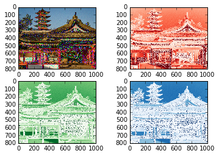

UECM3033 Assignment #2 Report
========================================================

- Prepared by: Yong Jun Ting 
- Tutorial Group: T3

--------------------------------------------------------

## Task 1 --  $LU$ Factorization or SOR method

The reports, codes and supporting documents are to be uploaded to Github at: 

https://github.com/JuntingYong/UECM3033_assign2

Explain your selection criteria here.

To set the condition: 

If the matrix is positive definite, we can use SOR method to solve the matrix. Matrix A is positive definite if only if A can be factorised into the form LL(Transpose) which is Choleski Method.  If matrix A cannot decomposed into choleski Method, then LU method is used to solve the matrix. 

To ensure convergence in using SOR, omega must be within 0 and 2.

Explain how you implement your `task1.py` here.

1.	To solve by LU method, first, define a function called “lu_decomp” and another function named “lu”. “lu” function solve the matrix     A by Ax=b and return (A,b).

2.	To solve by SOR, first we need to find the max absolute eigen value to compute the omega.
    Example : omega = 2*(1 - np.sqrt(1 -((pT)**2)))/((pT)**2), where pt is the spectral radius. 
    Noted that the value of omega need to be within 0 < omega < 2 to ensure convergence. 
    This function will first initialise x(0) as zero matrix. Then, it will compute the following x(j) until desired iteration. (In        this case, I set iteration limit to 100). This function then return list(sol). 

3.	Now, we want to set the condition. If the matrix is a positive definite matrix, it can be decomposed into LL(transpose)   
    factorisation which is Cholesky Method. 
    Thus, we use SOR method to solve it. 
    Else, the matrix will be solved by LU method.

Results : both given matrices are solved by LU.
          first matrix : 
          [ 1.  1.  1.]
          second matrix :
          [ 1.  -1.   4.  -3.5  7.  -1. ]

---------------------------------------------------------

## Task 2 -- SVD method and image compression

Put here your picture file (temple.png)

How many non zero element in $\Sigma$?

All elements in $\Sigma$ are zero element. 

Put here your lower and better resolution pictures. 

Lower resolution, when n = 30

Better resolution, when n = 200

Explain how you generate
these pictures from `task2.py`.

1.	Firstly, a function named svd is defined. Create new sigma matrix for red, green and blue respectively by copying each of original     $\Sigma$. 
    However, keep the first n nonzero element in $\Sigma$ and set the rest of the entries to zero. This can be done by using              np.zero_like. 
    For example:  Sig_red_new[n:800]=np.zeros_like(Sr[n:800]). 
    Same step goes to green and blue.

2.	Next, noted that the size of Sig_red_new is (800,1). Thus, in order to perform  multiplication of U,S and V, we need to change the     dimension of Sig_red_new to (800,1000). This can be done by using linalg.diagsvd.
    For example : Sig_red_new = sp.linalg.diagsvd(Sig_red_new,800,1000). Same step goes to green and blue.

3.	Then, create and display the new resolution matrix. Plot the image. 
 
4.	To display and plot the original image. First, read the “temple.jpg” into img where it contain 3 matrixes, which are r,g and b.   
    Then, compute the U,$\Sigma$ and V for for each of the red, green and blue matrices. 
    Numpy function, count_nonzero is used to find the number of nonzero elements in $\Sigma$ for the 3 colours.

5.	Finally, we can change the n where higher n for better resolution picture while lower n for lower resolution picture. In this 
    In this task, I called the svd function with n= 30 and n = 200.

What is a sparse matrix?

A sparse matrix is a matrix in which most of the elements are zero. By contrast, if most of the elements are nonzero, then the matrix is considered dense. In task 2, we have a dense sparse matrix when only the first 30 entries are non zero elements.

Sparse matrices also have significant advantages in terms of computational efficiency such as reduction in required storage space. For example, we make use of sparse matrix in task 2 in order to make the lower resolution picture.

-----------------------------------

last modified: 11/03/12 2:39am 
